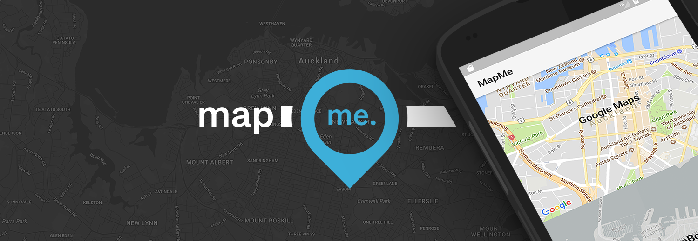

# MapMe



[  ](https://bintray.com/trademe/MapMe/mapme/_latestVersion)
[](https://travis-ci.org/TradeMe/MapMe)

MapMe is an Android library for working with Maps. MapMe brings the adapter pattern to Maps, simplifying the management of markers and annotations.

MapMe supports both [Google Maps](https://developers.google.com/maps/documentation/android-api/) and [Mapbox](https://www.mapbox.com/android-sdk/)


Download
-----

```groovy
//base dependency
compile 'nz.co.trademe.mapme:mapme:1.2.1'
  
//for Google Maps support
compile 'nz.co.trademe.mapme:googlemaps:1.2.1'
  
//for Mapbox support
compile 'nz.co.trademe.mapme:mapbox:1.2.1'

```

Usage
-----
A simple MapsAdapter might look like this:

```kotlin
class MapsAdapter(context: Context, private val markers: List<MarkerData>) : GoogleMapMeAdapter(context) {

    fun onCreateAnnotation(factory: AnnotationFactory, position: Int, annotationType: Int): MapAnnotation {
        val item = this.markers[position]
        return factory.createMarker(item.getLatLng(), null, item.getTitle())
    }

    fun onBindAnnotation(annotation: MapAnnotation, position: Int, payload: Any) {
        if (annotation is MarkerAnnotation) {
            val item = this.markers[position]
            annotation.setTitle(item.getTitle())
        }
    }

    val itemCount: Int
        get() = markers.size()
}

```

Using the adapter in your view:

```kotlin
val adapter: MapMeAdapter = GoogleMapMeAdapter(context, items)
adapter.setOnAnnotationClickListener(this)

mapView.getMapAsync { googleMap ->
    //Attach the adapter to the map view once it's initialized
    adapter.attach(mapView, googleMap)
}
```

Dispatch data updates to the adapter:

```kotlin
// add new data and tell the adapter about it

items.addAll(myData)
adapter.notifyDataSetChanged()

// or with DiffUtil

val diff = DiffUtil.calculateDiff(myDiffCallback)
diff.dispatchUpdatesTo(adapter)
```


Click listeners
-----
MapMe takes the pain out of click listeners too. No more setting tags on markers and trying to match a tag to your data when the click event is received.

MapMe has a `setOnAnnotationClickListener` method that will pass back a `MapAnnotation` containing the position of the item in the list of data:

```Kotlin
mapsAdapter.setOnAnnotationClickListener(OnMapAnnotationClickListener { annotation ->
            //retrieve the data item based on the position
            val item = myData[annotation.position]
            
            //handle item click here
            
            true
        })

```

**Info window** clicks are handled in the same way.

Animations
-----

While MapMe doesn't handle marker animations directly, it does provide a `onAnnotationAdded` method on the adapter that is called when a marker is added to the map.

This is the ideal place to start an animation.


For example, the following animates a markers alpha when it is added to the map:


```
override fun onAnnotationAdded(annotation: MapAnnotation) {
        if (annotation !is MarkerAnnotation) return

        ObjectAnimator.ofFloat(annotation, "alpha", 0f, 1f)
                .apply {
                    duration = 150
                    interpolator = DecelerateInterpolator()
                    start()
               }
}
```  
    

Markers and Annotations
-----
MapMe is based around the concept of Annotations. An annotation is anything displayed on the map.

The only annotation currently supported is Markers. We hope to support many more in the future.

*We'd love PR's adding support for more annotations!*


### Multiple annotation types
More complex adapters can override `getItemAnnotationType` to work with multiple annotations. The annotation type is passed to `onCreateAnnotation` just like in a RecyclerView Adapter.


### AnnotationFactory
MapMe differs from list adapters in that the creation of annotations must be left up to the map as they are not standard Android views.

The MapAdapter **onCreateAnnotation** method provides an **AnnotationFactory** as a parameter that must be used to create and return Map Annotations.


DiffUtil
-----
As well as support for standard Adapter methods such as *notifyDataSetChanged*, and *notifyItemInserted*, MapMe supports (and recommends) DiffUtil.

DiffUtil is where the true power of MapMe comes into play. Simple manipulate the data set, calculate the diff and dispatch it to MapMe. The map will instantly reflect the data.

A DiffResult can be dispatched to the MapAdapter just as you would a RecyclerView:

```java
DiffUtil.DiffResult diffResult = DiffUtil.calculateDiff(new MarkerDiffCallback(this.markers, newMarkers));
diffResult.dispatchUpdatesTo(mapAdapter);
```


Why the adapter pattern?
-----

Working with a few map markers is simple, but working with hundreds can become a mess of spaghetti code. 

The adapter pattern provides a clear separation of data from the view, allowing the data to be manipulated freely without the concern of updating the view.

We think this is a pattern fits perfectly with maps.


## Contributing

We love contributions, but make sure to checkout `CONTRIBUTING.MD` first!

